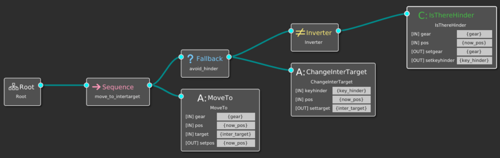

# <center>简易质点模型开发文档</center>

<center>韩颢颐 2022年5月4日</center>

## 一 开发环境及工具

- 开发及运行环境：Windows 10
    - Visual Studio 2022
    - Visual Studio Code 1.66.2
    - CMake 3.23.1 (WSL2环境下)
    - Groot (WSL2环境下)

## 二 项目或功能描述

本项目期望构建一个平面质点运动模型，质点以匀速沿直线前往多个中间目标点，并躲避路线上的障碍点，最终到达目标点。其间，通过事先定义的行为树严格控制质点运动，并记录过程数据，根据程序运行情况开展调试和改进。

## 三 编写目的

本项目致力于通过构建一个具有简易结构和行为逻辑的质点运动模型，以验证BehaviorTree.CPP行为树框架的使用，为之后的毕业设计项目打下基础。

## 四 项目或功能背景

本项目作为毕业设计项目的一个中间过渡项目，其结果主要用于测试编写者对框架各功能以及原理的理解和掌握程度，该项目的完成情况将很大程度上影响编写者对后续项目的开发和推进，需要尽快进行。

## 五 模块与关系

本项目计划设置三个模块（以独立的头文件形式进行定义），分别表述质点模型及其功能函数，主行为树所含节点及相关功能函数，以及行为树子树所含节点及相关功能函数。具体内容如下表所示。

| Module Name                              | Header file name | Cpp file name     |
| ---------------------------------------- | ---------------- | ----------------- |
| Mass Point Model                         | mass_point.h     | mass_point.cpp    |
| Behavior Tree Nodes Model For Mass Point | mass_bt_nodes.h  | mass_bt_nodes.cpp |

## 六 类或术语说明（待补充）

以下将针对不同模块，分别描述其中含有的类及相关术语。

`mass_point.h`

| Type Name | Type     | Description  | Var                             |
| --------- | -------- | ------------ | ------------------------------- |
| `Point2D` | `struct` | 平面质点模型 | `public: double x, y, v, theta` |

针对以上类型定义的函数：

| Func Name                                             | Type     | Privacy  | Description      |
| ----------------------------------------------------- | -------- | -------- | ---------------- |
| `Point2D(double x, double y, double v, double theta)` | `void`   | `public` | 初始化           |
| `getVX()`                                             | `double` | `public` | 计算速度水平分量 |
| `getVY()`                                             | `double` | `public` | 计算速度垂直分量 |
| `changePos(double x, double y)`                       | `void`   | `public` | 更改位置为指定值 |

以上头文件中定义的其他函数：

| Func Name                                                | Type                    | Description      |
| -------------------------------------------------------- | ----------------------- | ---------------- |
| `calcDistPoints(Point2D pA, Point2D pB)`                 | `double`                | 计算两点距离     |
| `calcLineEqCoeff (Point2D pA, Point2D pB)`               | `std::array<double, 3>` | 计算两点直线方程 |
| `CalcDistPointLine(Point2D p, std::array <double, 3> l)` | `double`                | 计算点到直线距离 |

`mass_bt_nodes.h`

| Class Name          | Type                 | Description                    | Var                                                          |
| ------------------- | -------------------- | ------------------------------ | ------------------------------------------------------------ |
| `CreateMass`        | `BT::SyncActionNode` | 初始化质点并打印质点坐标到文件 | `private: Point2D _now_pos`                                  |
| `CreateInterTarget` | `BT::SyncActionNode` | 初始化中间目标点               | `private: Point2D _target`                                   |
| `IsOnTarget`        | `BT::ConditionNode`  | 判定是否到达目标点             | `private: Point2D _target, double _reach_dist`               |
| `IsCloseToTarget`   | `BT::ConditionNode`  | 判定是否接近目标点             | `private: Point2D _target, double _safe_dist`                |
| `IsThereHinder`     | `BT::ConditionNode`  | 判定障碍点是否在附近           | `private: Point2D _target, Point2D _hinder, double _safe_dist` |
| `ChangeInterTarget` | `BT::SyncActionNode` | 变更中间目标点                 | `private: Point2D _target, Point2D _hinder, double _safe_dist, Point2D _inter_target, double _m` |
| `ResetInterTarget`  | `BT::SyncActionNode` | 重设中间目标点                 | `private: Point2D _target`                                   |
| `MoveTo`            | `BT::SyncActionNode` | 向中间目标点运动               | `private: double _tick_time`                                 |

以上所有节点类均定义以下函数：

| Func Name                                                    | Type               | Privacy  | Description          |
| ------------------------------------------------------------ | ------------------ | -------- | -------------------- |
| `ClassName(const std::string & name, const BT::NodeConfiguration & config)` | `void`             | `public` | 初始化传入待使用常量 |
| `providedPorts()`                                            | `static PortsList` | `public` | 连接输入/输出端口    |
| `tick()`                                                     | `BT::NodeStatus`   | `public` | 触发函数             |

以上头文件中定义的其他函数：

| Func Name                                         | Type          | Description                |
| ------------------------------------------------- | ------------- | -------------------------- |
| `RegisterNodes(BT::BehaviorTreeFactory& factory)` | `inline void` | 注册所有已定义节点         |
| `InitNodes()`                                     | `inline void` | 初始化所有已注册节点       |
| `convertSpeedFromGear(std::string gear)`          | `double`      | 根据档位返回相应设定速度值 |

## 七 参考资料

- BehaviorTree.CPP[官方文档](https://www.behaviortree.dev/)
- BehaviorTree.CPP在CSDN上的[指导教程](https://blog.csdn.net/whahu1989/article/details/112295130)

## 八 项目进度预估

本项目预计在一周内全部完成，并迅速计划吸取经验投入后续项目研究。

## 九 难点预估

### 9.1 质点如何运动

在类定义里定义了质点的位置`double x, y;`，以及质点的当前瞬时速度`double v, theta;`，其中`v`是速度大小，`theta`是速度与笛卡尔坐标系第一象限的夹角，由此可以计算出速度沿坐标轴的投影分量`vx, vy`；设置最小间隔时长`double tick_time`，约定每次`tick()`触发时质点以当前瞬时速度匀速向前运动`tick_time`时长，即：

```cpp
x += vx * tick_time;
y += vy * tick_time;
```

其中在每次`tick()`触发时，质点瞬时速度均重置，大小不变仍为恒定值，方向指向中间目标点（中间目标点在有障碍点时重新定义，在无障碍点时重置为目标点），根据此时方向重新计算相应的`vx, vy`并赋值使用。

### 9.2 质点如何判断障碍点

我们将平面图中的障碍点也按照质点方式定义，其速度暂时定义为0，其障碍性体现在，该点与运动质点预计前行路径的垂直距离，小于规定的安全距离。为了计算这一垂直距离，考察平面上的三点$P_1(x_1, y_1), P_2(x_2, y_2), P_3(x_3, y_3)$，则不失一般性，直线$P_1P_2$可以定义为$Ax+By+C=0$，其中各系数为
$$
A = y_1 - y_2 \\
B = x_2 - x_1 \\
C = x_1y_2 - x_2y_1
$$
平面坐标系中点$P_3$到直线$P_1P_2$的垂直距离为
$$
d_\text{real} = \frac{|Ax_3 + By_3 + C|}{\sqrt{A^2 + B^2}}
$$
设安全距离$d_\text{safe}$为常数，则障碍点的判断规则为$d_\text{real} < d_\text{safe}$是否成立。

此外，本项目**暂定障碍点数目为1且绝对位置已知**，视开发情况再进行细节调整或更改。

### 9.3 质点如何躲避障碍点

我们通过在质点当前位置$P_1$与目标点$P_2$之间，设置一个中间点$P_4$，并控制质点以直线路径先前往中间点，再从中间点出发前往目标点的方式，完成对障碍点$P_3$的躲避。我们定义$P_4$在$P_3$到直线$P_1P_2$的垂线上，且$|P_3P_4| = md_\text{safe}$，其中$m>1$是一个调整因数；同时，规定$P_3, P_4$位于直线$P_1P_2$两侧，从而保证中间点的存在性和唯一性，并最大限度减小绕路成本。

易求得直线$P_3P_4$的方程为$Bx - Ay + (Ay_3 - Bx_3) = 0$，则不失一般性，$|P_3P_4|^2 = (x_4 - x_3)^2 (1 + (\frac{B}{A})^2) = (md_\text{safe})^2$，解得
$$
(x_4)_{1, 2} = x_3 \pm \frac{md_\text{safe}}{\sqrt{1 + (\frac{B}{A})^2}}
$$
为确定是哪一个解使$P_3, P_4$位于直线$P_1P_2$两侧，只要验证式$(Ax_3 + By_3 + C)(Ax_4 + By_4 + C) < 0$是否成立即可。验证后，通过公式$y_4 = \frac{B}{A}x_4 + (y_3 - \frac{B}{A}x_3)$得到$y_4$，从而定义$P_4(x_4, y_4)$。

### 9.4 质点如何判断到达目标点

采用障碍点定义中的类似方法，当质点当前位置与目标点位置间距小于规定的标定距离（该距离与安全距离不同，应设置为远小于安全距离）时，即认为质点已到达目标点。

### 9.5 质点的速度控制

考虑到质点在躲避障碍点和接近目标点时，不能以过高的速度运动，否则会导致撞上障碍点或者永远无法到达目标点附近，我们为质点的速度设置三个档位：高速、中速和低速。质点在没有障碍点干扰，且离目标点较远时以高速运动；质点判断到障碍点的存在时改为中速；质点判断到位于目标点附近时改为低速；当判定位于目标点附近时，无论有无障碍点干扰，均改为以低速运动。

## 十 功能与所计划采用的技术

这里我们尝试描述项目中用到的行为树。其符合框架BehaviorTree.CPP格式要求的xml文本书写如下。

`TreeNodes.xml`

```xml
<?xml version="1.0"?>

<root main_tree_to_execute="MainTree">
	<BehaviorTree ID="MainTree">
		<Sequence>
			<Action ID="CreateMass" pos="{now_pos}" setpos="{now_pos}"/>
			<Action ID="CreateInterTarget" target="{inter_target}" settarget="{inter_target}"/>
			<Fallback name="main_control">
				<Condition ID="IsOnTarget" pos="{now_pos}"/>
				<ForceFailure>
					<Sequence name="move_and_set_target">
						<ForceSuccess>
							<Condition ID="IsCloseToTarget" pos="{now_pos}" setgear="{gear}"/>
						</ForceSuccess>
						<SubTree ID="MoveBase" now_pos="now_pos" gear="gear" inter_target="inter_target"/>
						<Action ID="ResetInterTarget" settarget="{inter_target}" setgear="high"/>
					</Sequence>
				</ForceFailure>
			</Fallback>
		</Sequence>
	</BehaviorTree>
	<BehaviorTree ID="MoveBase">
		<Sequence name="move_to_intertarget">
			<Fallback name="avoid_hinder">
				<Inverter>
					<Condition ID="IsThereHinder" pos="{now_pos}" gear="{gear}" setgear="{gear}"/>
				</Inverter>
				<Action ID="ChangeInterTarget" pos="{now_pos}" settarget="{inter_target}"/>
			</Fallback>
			<Action ID="MoveTo" pos="{now_pos}" gear="{gear}" target="{inter_target}" setpos="{now_pos}"/>
		</Sequence>
	</BehaviorTree>
	<TreeNodesModel>
		<!-- ############################### ACTION NODES ################################# -->
		<Action ID="CreateMass">
			<input_port name="pos" type="Point2D">get the current position</input_port>
			<output_port name="setpos" type="Point2D">transfer the position to output or reset the original position</output_port>
		</Action>
		<Action ID="CreateInterTarget">
			<input_port name="target" type="Point2D">get the current target</input_port>
			<output_port name="settarget" type="Point2D">transfer the target to output or reset the original target</output_port>
		</Action>		
		<Action ID="ChangeInterTarget">
			<input_port name="pos" type="Point2D">get the current position</input_port>
			<output_port name="settarget" type="Point2D">set a new intermediate target to avoid the hinder</output_port>
		</Action>
		<Action ID="MoveTo">
			<input_port name="pos" type="Point2D">get the current position</input_port>
			<input_port name="gear" type="std::string">get the current gear</input_port>
			<input_port name="target" type="Point2D">get the target to move</input_port>
			<output_port name="setpos" type="Point2D">change the current position</output_port>
		</Action>
		<Action ID="ResetInterTarget">
			<output_port name="settarget" type="Point2D">reset the original target</output_port>
			<output_port name="setgear" type="std::string">reset the original gear as high</output_port>
		</Action>

		<!-- ############################### CONDITION NODES ############################## -->
		<Condition ID="IsOnTarget">
			<input_port name="pos" type="Point2D">get the current position</input_port>
		</Condition>
		<Condition ID="IsCloseToTarget">
			<input_port name="pos" type="Point2D">get the current position</input_port>
			<output_port name="setgear" type="std::string">set the gear according to the result</output_port>
		</Condition>
		<Condition ID="IsThereHinder">
			<input_port name="pos" type="Point2D">get the current position</input_port>
			<input_port name="gear" type="std::string">get the current gear</input_port>
			<output_port name="setgear" type="std::string">set the gear according to the result</output_port>
		</Condition>

		<!-- ############################### CONTROL NODES ################################ -->


		<!-- ############################### DECORATOR NODES ############################## -->


		<!-- ############################### SUBTREE ###################################### -->
		<SubTree ID="MoveBase">
			<input_port name="gear"/>
			<input_port name="inter_target"/>
			<inout_port name="now_pos"/>
		</SubTree>
	</TreeNodesModel>
</root><?xml version="1.0"?>

<root main_tree_to_execute="MainTree">
	<!-- ////////// -->
	<BehaviorTree ID="MainTree">
		<Sequence>
			<SetBlackboard output_key="now_pos" value="0.0;0.0;5.0;0.0"/>
			<SequenceStar name="root">
				<Fallback name="main_control">
					<Condition ID="IsOnTarget" pos="{now_pos}"/>
					<ForceFailure>
						<Sequence name="move_and_set_target">
							<ForceSuccess>
								<Condition ID="IsCloseToTarget" pos="{now_pos}" setgear="{gear}"/>
							</ForceSuccess>
							<SubTree ID="MoveBase" now_pos="now_pos" gear="gear" inter_target="inter_target"/>
							<Action ID="ResetInterTarget" settarget="{inter_target}"/>
						</Sequence>
					</ForceFailure>
				</Fallback>
			</SequenceStar>
		</Sequence>
	</BehaviorTree>
	<!-- ////////// -->
	<BehaviorTree ID="MoveBase">
		<Sequence name="move_to_intertarget">
			<Fallback name="avoid_hinder">
				<Inverter>
					<Condition ID="IsThereHinder" pos="{now_pos}" gear="{gear}" setgear="{gear}"/>
				</Inverter>
				<Action ID="ChangeInterTarget" pos="{now_pos}" settarget="{inter_target}"/>
			</Fallback>
			<Action ID="MoveTo" pos="{now_pos}" gear="{gear}" target="{inter_target}" setpos="{now_pos}"/>
		</Sequence>
	</BehaviorTree>
	<!-- ////////// -->
	<TreeNodesModel>
		<!-- ############################### ACTION NODES ################################# -->
		<Action ID="ChangeInterTarget" input_ports="pos" output_ports="settarget"/>
		<Action ID="MoveTo" input_ports="pos;gear;target" output_ports="setpos"/>
		<Action ID="ResetInterTarget" output_ports="settarget;setgear"/>

		<!-- ############################### CONDITION NODES ############################## -->
		<Condition ID="IsOnTarget" input_ports="pos"/>
		<Condition ID="IsCloseToTarget" input_ports="pos" output_ports="setgear"/>
		<Condition ID="IsThereHinder" input_ports="pos" output_ports="setgear"/>

		<!-- ############################### CONTROL NODES ################################ -->


		<!-- ############################### DECORATOR NODES ############################## -->


	</TreeNodesModel>
	<!-- ////////// -->
</root>
```

其图形化结构利用Groot工具可以显示如下：

<center></center>

<center>主行为树</center>

<center></center>

<center>子行为树</center>

在此行为树执行过程中，相应的Blackboard设置如下：

| KEY          | TYPE                             | VALUE (Ex.)                                     |
| ------------ | -------------------------------- | ----------------------------------------------- |
| now_pos      | `Point2D` saved as `std::string` | `"50.00;50.00;5.00;0.00"` (2 digits of decimal) |
| gear         | `std::string`                    | `"high"`, `"mid"`, `"low"`                      |
| inter_target | `Point2D` saved as `std:string`  | `"100.0;100.0;0.0;0.0"` (1 digit of decimal)    |


## 十一 用户界面与交互

本项目囿于知识水平，暂不准备开发相关界面。当前会通过行为树框架里的Logger或自行编写相关函数保存质点运动数据，并在程序运行结束后，尝试用其他方式作图（如python的matplotlib模块）展示质点的实际运动过程。

## 十二 软件（代码）接口 注释文档

## 十三 通信（网络）接口 接口文档

## 十四 问题与修复说明 - Bug修复文档

## 十五 性能分析与优化