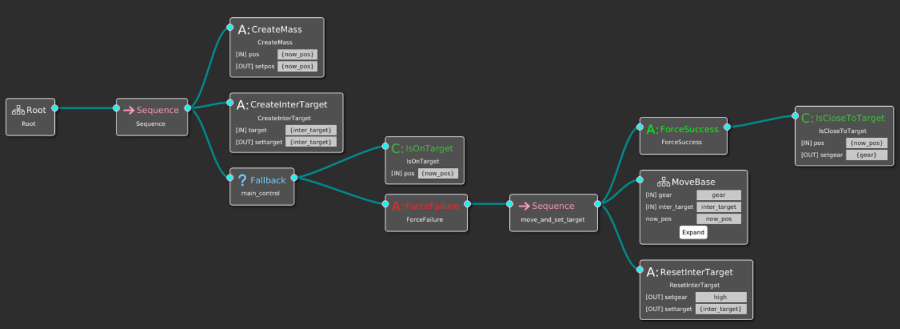
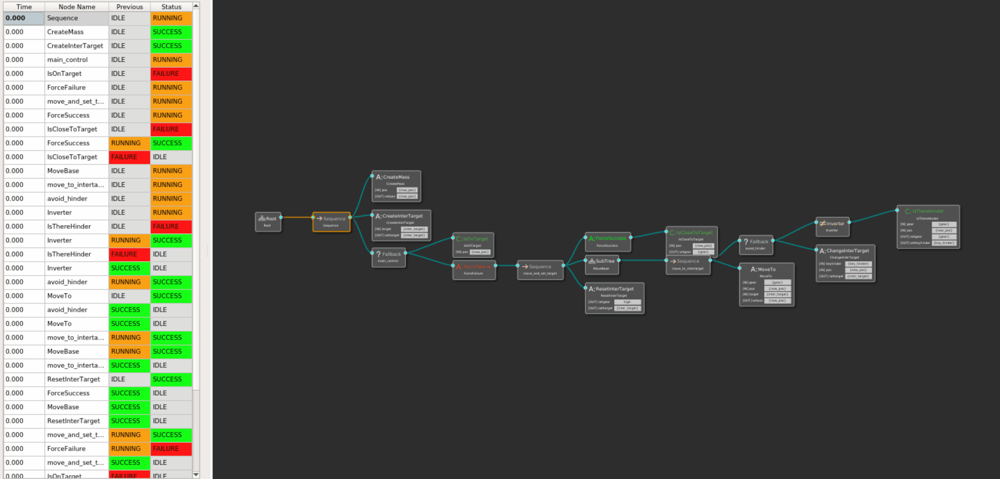
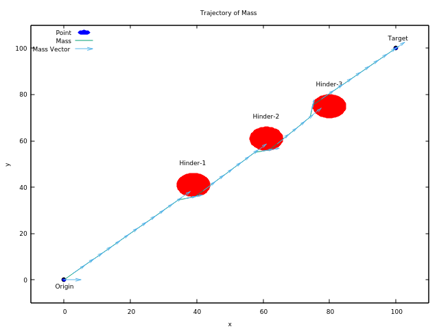
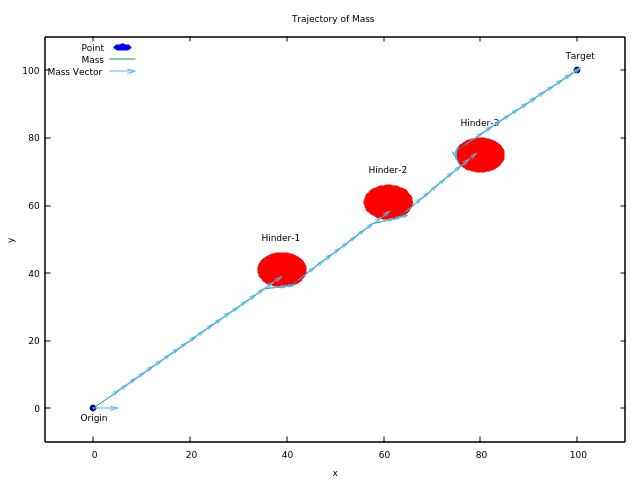
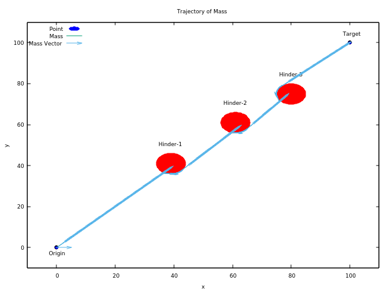

# <center>SimpleMassDuel 简易质点模型</center>

## 一 开发环境及工具

- 开发及运行环境：Windows 10 WSL2 Ubuntu
    - Visual Studio 2022（主要作为编辑器）
    - CMake 3.23.1 (Ubuntu环境下，作为编译工具)
    - GDB 10.2（Ubuntu环境下，作为调试工具）
    - Groot (Ubuntu环境下，作为行为树相关工具)

## 二 项目内容及背景

本项目期望构建一个平面质点运动模型，质点以匀速沿直线前往多个中间目标点，并躲避路线上的障碍点，最终到达目标点。其间，通过事先定义的行为树严格控制质点运动，并记录过程数据，根据程序运行情况开展调试和改进。本项目致力于通过构建这样一个具有简易结构和行为逻辑的质点运动模型，以验证BehaviorTree.CPP行为树框架的使用，为之后的毕业设计项目打下基础。作为毕业设计项目的一个中间过渡项目，本项目结果主要用于测试编写者对框架各功能以及原理的理解和掌握程度，该项目的完成情况将很大程度上影响编写者对后续项目的开发和推进，需要尽快进行。

## 三 模块和类的说明

本项目计划设置三个模块（以独立的头文件形式进行定义），分别表述质点模型及其功能函数，主行为树所含节点及相关功能函数，以及行为树子树所含节点及相关功能函数。具体内容如下表所示。

| Module Name                              | Header file name | Cpp file name     |
| ---------------------------------------- | ---------------- | ----------------- |
| Mass Point Model                         | mass_point.h     | mass_point.cpp    |
| Behavior Tree Nodes Model For Mass Point | mass_bt_nodes.h  | mass_bt_nodes.cpp |

以下将针对不同模块，分别描述其中含有的类及相关术语。

`mass_point.h`

| Type Name | Type     | Description  | Var                             |
| --------- | -------- | ------------ | ------------------------------- |
| `Point2D` | `struct` | 平面质点模型 | `public: double x, y, v, theta` |

`Point2D`结构体中定义的函数：

| Func Name   | Type      | Description | Func Name                | Type      | Description                    |
| ----------- | --------- | ----------- | ------------------------ | --------- | ------------------------------ |
| `Point2D()` | `void`    | 初始化      | `vx()`                   | `double`  | 计算速度水平分量               |
| `==()`      | `bool`    | 重载等号    | `vy()`                   | `double`  | 计算速度垂直分量               |
| `+()`       | `Point2D` | 重载加号    | `mod()`                  | `double`  | 计算原点与质点距离             |
| `-()`       | `Point2D` | 重载减号    | `rot(double angle)`      | `Point2D` | 定义按角度逆时针旋转           |
| `scalar(m)` | `Point2D` | 定义数乘    | `move(double tick_time)` | `Point2D` | 按当前运动状态运动一个时间间隔 |

针对`Point2D`结构体定义的函数：

| Func Name      | Type            | Description          |
| -------------- | --------------- | -------------------- |
| `<<()`         | `std::ostream&` | 重载标准输出         |
| `pToString(p)` | `std::string`   | 定义标准转换为字符串 |

以上头文件中定义的其他计算函数：

| Func Name                                         | Type                      | Description                  |
| ------------------------------------------------- | ------------------------- | ---------------------------- |
| `calcDistPoints(pA, pB)`                          | `double`                  | 计算两点距离                 |
| `calcAngleVectors(vA, vB)`                        | `double`                  | 计算两向量夹角               |
| `calcLineEqCoeff(pA, pB)`                         | `std::array<double, 3>`   | 计算两点直线方程             |
| `CalcDistPointLine(p, l)`                         | `double`                  | 计算点到直线距离             |
| `calcDistTriPoints(pA, pB, pC)`                   | `double`                  | 计算第三点到前两点连线的距离 |
| `isTwoPointBilateral(pA, pB, l)`                  | `bool`                    | 判断两点是否在给定直线两侧   |
| `calcTanPointsOnCircle(pM, Point2D pC, double r)` | `std::array <Point2D, 2>` | 计算点到给定圆的切线切点     |
| `calcWeightedAvg(A, B, fA, fB)`                   | `double`                  | 计算加权平均和               |

`mass_bt_nodes.h`

| Class Name          | Type                 | Description                    | Var                                                          |
| ------------------- | -------------------- | ------------------------------ | ------------------------------------------------------------ |
| `CreateMass`        | `BT::SyncActionNode` | 初始化质点并打印质点坐标到文件 | `private: Point2D _origin, std::string _tracemass_filename, bool _SAVE` |
| `CreateInterTarget` | `BT::SyncActionNode` | 初始化中间目标点               | `private: Point2D _target`                                   |
| `IsOnTarget`        | `BT::ConditionNode`  | 判定是否到达目标点             | `private: Point2D _target, double _reach_dist`               |
| `IsCloseToTarget`   | `BT::ConditionNode`  | 判定是否接近目标点             | `private: Point2D _target, double _safe_dist`                |
| `IsThereHinder`     | `BT::ConditionNode`  | 判定障碍点是否在附近           | `private: Point2D _target, std::vector<Point2D> _hinder_list, double _safe_dist` |
| `ChangeInterTarget` | `BT::SyncActionNode` | 变更中间目标点                 | `private: Point2D _target, double _safe_dist, Point2D _inter_target, double _m` |
| `ResetInterTarget`  | `BT::SyncActionNode` | 重设中间目标点                 | `private: Point2D _target`                                   |
| `MoveTo`            | `BT::SyncActionNode` | 向中间目标点运动               | `private: double _tick_time`                                 |

以上所有节点类均定义以下函数：

| Func Name                                                    | Type               | Privacy  | Description          |
| ------------------------------------------------------------ | ------------------ | -------- | -------------------- |
| `ClassName(const std::string & name, const BT::NodeConfiguration & config)` | `void`             | `public` | 初始化传入待使用常量 |
| `init()`                                                     | `void`             | `public` | 另一种初始化方式     |
| `providedPorts()`                                            | `static PortsList` | `public` | 连接输入/输出端口    |
| `tick()`                                                     | `BT::NodeStatus`   | `public` | 触发函数             |

以上头文件中定义的其他函数：

| Func Name                                         | Type          | Description                |
| ------------------------------------------------- | ------------- | -------------------------- |
| `RegisterNodes(BT::BehaviorTreeFactory& factory)` | `inline void` | 注册所有已定义节点         |
| `InitNodes()`                                     | `inline void` | 初始化所有已注册节点       |
| `gearToSpeed(std::string gear)`                   | `double`      | 根据档位返回相应设定速度值 |

## 四 难点预估

### 4.1 质点如何运动

在类定义里定义了质点的位置`double x, y`，以及质点的当前瞬时速度`double v, theta`，其中`v`是速度大小，`theta`是速度与笛卡尔坐标系第一象限的夹角，由此可以计算出速度沿坐标轴的投影分量`vx, vy`；设置最小间隔时长`double tick_time`，约定每次`tick()`触发时质点以当前瞬时速度匀速向前运动`tick_time`时长，即：

```cpp
vx = v * cos(theta);
vy = v * sin(theta);
x += vx * tick_time;
y += vy * tick_time;
```

其中在每次`tick()`触发时，质点瞬时速度均重置，大小不变仍为恒定值，方向指向中间目标点（中间目标点在有障碍点时重新定义，在无障碍点时重置为目标点），根据此时方向重新计算相应的`vx, vy`并赋值使用。

### 4.2 质点如何判断障碍点

我们将平面图中的障碍点也按照质点方式定义，其速度暂时定义为0，其障碍性体现在，该点与运动质点预计前行路径的垂直距离，小于规定的安全距离。为了计算这一垂直距离，考察平面上的三点$P_1(x_1, y_1), P_2(x_2, y_2), P_3(x_3, y_3)$，则不失一般性，直线$P_1P_2$可以定义为$Ax+By+C=0$，其中各系数为
$$
A = y_1 - y_2 \\
B = x_2 - x_1 \\
C = x_1y_2 - x_2y_1
$$
平面坐标系中点$P_3$到直线$P_1P_2$的垂直距离为
$$
d_\text{real} = \frac{|Ax_3 + By_3 + C|}{\sqrt{A^2 + B^2}}
$$
设安全距离$d_\text{safe}$为常数，则障碍点的判断规则为$d_\text{real} < d_\text{safe}$是否成立。

此外，本项目**暂定障碍点数目为1且绝对位置已知**，视开发情况再进行细节调整或更改。

### 4.3 质点如何从多个备选障碍点中筛选最具威胁障碍点

### 4.4 质点如何躲避障碍点

我们通过在质点当前位置$P_1$与目标点$P_2$之间，设置一个中间点$P_4$，并控制质点以直线路径先前往中间点，再从中间点出发前往目标点的方式，完成对障碍点$P_3$的躲避。我们定义$P_4$在$P_3$到直线$P_1P_2$的垂线上，且$|P_3P_4| = md_\text{safe}$，其中$m>1$是一个调整因数；同时，规定$P_3, P_4$位于直线$P_1P_2$两侧，从而保证中间点的存在性和唯一性，并最大限度减小绕路成本。

易求得直线$P_3P_4$的方程为$Bx - Ay + (Ay_3 - Bx_3) = 0$，则不失一般性，$|P_3P_4|^2 = (x_4 - x_3)^2 (1 + (\frac{B}{A})^2) = (md_\text{safe})^2$，解得
$$
(x_4)_{1, 2} = x_3 \pm \frac{md_\text{safe}}{\sqrt{1 + (\frac{B}{A})^2}}
$$
为确定是哪一个解使$P_3, P_4$位于直线$P_1P_2$两侧，只要验证式$(Ax_3 + By_3 + C)(Ax_4 + By_4 + C) < 0$是否成立即可。验证后，通过公式$y_4 = \frac{B}{A}x_4 + (y_3 - \frac{B}{A}x_3)$得到$y_4$，从而定义$P_4(x_4, y_4)$。

### 4.5 质点如何判断到达目标点

采用障碍点定义中的类似方法，当质点当前位置与目标点位置间距小于规定的标定距离（该距离与安全距离不同，应设置为远小于安全距离）时，即认为质点已到达目标点。

### 4.6 质点的速度控制

考虑到质点在躲避障碍点和接近目标点时，不能以过高的速度运动，否则会导致撞上障碍点或者永远无法到达目标点附近，我们为质点的速度设置三个档位：高速、中速和低速。质点在没有障碍点干扰，且离目标点较远时以高速运动；质点判断到障碍点的存在时改为中速；质点判断到位于目标点附近时改为低速；当判定位于目标点附近时，无论有无障碍点干扰，均改为以低速运动。

## 五 功能与采用的技术

这里我们尝试描述项目中用到的行为树。其符合框架BehaviorTree.CPP格式要求的xml文本书写如下。

`TreeNodes.xml`

```xml
<?xml version="1.0"?>

<root main_tree_to_execute="MainTree">
	<BehaviorTree ID="MainTree">
		<Sequence>
			<Action ID="CreateMass" pos="{now_pos}" setpos="{now_pos}"/>
			<Action ID="CreateInterTarget" target="{inter_target}" settarget="{inter_target}"/>
			<Fallback name="main_control">
				<Condition ID="IsOnTarget" pos="{now_pos}"/>
				<ForceFailure>
					<Sequence name="move_and_set_target">
						<ForceSuccess>
							<Condition ID="IsCloseToTarget" pos="{now_pos}" setgear="{gear}"/>
						</ForceSuccess>
						<SubTree ID="MoveBase" now_pos="now_pos" gear="gear" inter_target="inter_target"/>
						<Action ID="ResetInterTarget" settarget="{inter_target}" setgear="high"/>
					</Sequence>
				</ForceFailure>
			</Fallback>
		</Sequence>
	</BehaviorTree>
	<BehaviorTree ID="MoveBase">
		<Sequence name="move_to_intertarget">
			<Fallback name="avoid_hinder">
				<Inverter>
					<Condition ID="IsThereHinder" pos="{now_pos}" gear="{gear}" setgear="{gear}" setkeyhinder="{key_hinder}"/>
				</Inverter>
				<Action ID="ChangeInterTarget" pos="{now_pos}" keyhinder="{key_hinder}" settarget="{inter_target}"/>
			</Fallback>
			<Action ID="MoveTo" pos="{now_pos}" gear="{gear}" target="{inter_target}" setpos="{now_pos}"/>
		</Sequence>
	</BehaviorTree>
	<TreeNodesModel>
		<!-- ############################### ACTION NODES ################################# -->
		<Action ID="CreateMass">
			<input_port name="pos" type="Point2D">get the current position</input_port>
			<output_port name="setpos" type="Point2D">transfer the position to output or reset the original position</output_port>
		</Action>
		<Action ID="CreateInterTarget">
			<input_port name="target" type="Point2D">get the current target</input_port>
			<output_port name="settarget" type="Point2D">transfer the target to output or reset the original target</output_port>
		</Action>		
		<Action ID="ChangeInterTarget">
			<input_port name="pos" type="Point2D">get the current position</input_port>
			<input_port name="keyhinder" type="Point2D">get the hinder which is the most threated</input_port>
			<output_port name="settarget" type="Point2D">set a new intermediate target to avoid the hinder</output_port>
		</Action>
		<Action ID="MoveTo">
			<input_port name="pos" type="Point2D">get the current position</input_port>
			<input_port name="gear" type="std::string">get the current gear</input_port>
			<input_port name="target" type="Point2D">get the target to move</input_port>
			<output_port name="setpos" type="Point2D">change the current position</output_port>
		</Action>
		<Action ID="ResetInterTarget">
			<output_port name="settarget" type="Point2D">reset the original target</output_port>
			<output_port name="setgear" type="std::string">reset the original gear as high</output_port>
		</Action>

		<!-- ############################### CONDITION NODES ############################## -->
		<Condition ID="IsOnTarget">
			<input_port name="pos" type="Point2D">get the current position</input_port>
		</Condition>
		<Condition ID="IsCloseToTarget">
			<input_port name="pos" type="Point2D">get the current position</input_port>
			<output_port name="setgear" type="std::string">set the gear according to the result</output_port>
		</Condition>
		<Condition ID="IsThereHinder">
			<input_port name="pos" type="Point2D">get the current position</input_port>
			<input_port name="gear" type="std::string">get the current gear</input_port>
			<output_port name="setgear" type="std::string">set the gear according to the result</output_port>
			<output_port name="setkeyhinder" type="Point2D">set the hinder which is the most threated to the mass</output_port>
		</Condition>
        
		<!-- ############################### SUBTREE ###################################### -->
		<SubTree ID="MoveBase">
			<input_port name="gear"/>
			<input_port name="inter_target"/>
			<inout_port name="now_pos"/>
		</SubTree>
	</TreeNodesModel>
</root>
```

其图形化结构利用Groot工具可以显示如下：

<center></center>

<center>主行为树</center>

<center></center>

<center>子行为树</center>

在此行为树执行过程中，相应的Blackboard设置如下：

| KEY          | TYPE                             | VALUE (Ex.)                                     |
| ------------ | -------------------------------- | ----------------------------------------------- |
| now_pos      | `Point2D` saved as `std::string` | `"50.00;50.00;5.00;0.00"` (2 digits of decimal) |
| gear         | `std::string`                    | `"high"`, `"mid"`, `"low"`                      |
| key_hinder   | `Point2D` saved as `std::string` | `"39.0;41.0;0.0;0.0"` (1 digit of decimal)      |
| inter_target | `Point2D` saved as `std:string`  | `"100.0;100.0;0.0;0.0"` (1 digit of decimal)    |

其中速度档位与实际运动速度的映射表为：

| Gear | Speed |
| ---- | ----- |
| high | 5.0   |
| mid  | 3.0   |
| low  | 1.0   |

## 六 用户界面与交互

### 6.1 启动界面

本项目的运行程序具有参数化的命令行交互界面如下：

```shell
Project started ...                                                             
Options:                                                                        
  -h [ --help ]                         produce help message                    
  -t [ --text ]                         read xml from program stored default    
                                        text                                    
  -f [ --file ] [=arg(=./TreeNodes.xml)]                                        
                                        read xml from given file path           
  -c [ --ticktime ] [=arg(=0.5)]        define a time period for each tick      
  -p [ --logprint ]                     display state changes in terminal       
  -r [ --logrecord ] [=arg(=bt_trace)]  record state changes in file            
  -m [ --logmonitor ]                   use ZeroMQ to publish state changes for 
                                        Groot to monitor                        
  -s [ --savetrace ] [=arg(=./trace_mass.dat)]                                  
                                        save the traject of mass point to file  
  -l [ --loop ] [=arg(=0)]              turn on loop mode to tick multi times   
                                        till end                                
```

其中各参数命令的功能简要介绍如下：

- `-h, --help`：帮助命令，程序默认无参数时运行帮助命令
- `-t, --text`：从程序自带配置文本中读取行为树，该参数不能与`-f`同时使用
- `-f, --file`：从外部XML配置文件中读取行为树，默认文件名为TreeNodes.xml，该参数不能与`-t`同时使用
- `-c, --ticktime`：设置两次`tick`间隔时间，默认为0.5
- `-p, --logprint`：在控制台中打印行为树运行状态
- `-r, --logrecord`：打印行为树运行状态到`.fbl`文件中，供Groot回放
- `-m, --logmonitor`：实时广播行为树运行状态，供Groot接收
- `-s, --savetrace`：保存质点运动数据到文件，默认文件名为trace_mass.dat
- `-l, --loop`：设置`tick`次数，默认为0（即持续`tick`直到行为树返回`SUCCESS`或`FAILURE`），如无此参数则相当于`-l 1`

### 6.2 常规运行情况

运行命令`./demo -t`，可在控制台中看到仅`tick`一次的行为树运行情况如下：

```shell
Project started ...                                        
Register SyncActionNode CreateMass.                        
Register SyncActionNode CreateInterTarget.                 
Register ConditionNode IsOnTarget.                         
Register ConditionNode IsCloseToTarget.                    
Register ConditionNode IsThereHinder.                      
Register SyncActionNode ChangeInterTarget.                 
Register SyncActionNode ResetInterTarget.                  
Register SyncActionNode MoveTo.                            
All Nodes Registered.                                      
Read from stored xml data ...                              
Tree well created.                                         
Node CreateMass Initialized.                               
Node CreateInterTarget Initialized.                        
Node IsOnTarget Initialized.                               
Node IsCloseToTarget Initialized.                          
Node IsThereHinder Initialized.                            
Node ChangeInterTarget Initialized.                        
Node MoveTo Initialized.                                   
Node ResetInterTarget Initialized.                         
All Nodes Initialized.                                     
----------------                                           
Sequence                                                   
   CreateMass                                              
   CreateInterTarget                                       
   main_control                                            
      IsOnTarget                                           
      ForceFailure                                         
         move_and_set_target                               
            ForceSuccess                                   
               IsCloseToTarget                             
            MoveBase                                       
               move_to_intertarget                         
                  avoid_hinder                             
                     Inverter                              
                        IsThereHinder                      
                     ChangeInterTarget                     
                  MoveTo                                   
            ResetInterTarget                               
----------------                                           
BehaviorTree is successfully printed.                      
Create a mass for moving.                                  
Create a target for moving.                                
Distance Mass-Target:141.4214                              
Still in course.                                           
Far from target. Set high gear.                            
Hinder { 39.0000;41.0000;0.0000;0.0000 } score: 0.2678     
Hinder { 61.0000;61.0000;0.0000;0.0000 } score: 0.4170     
Hinder { 80.0000;75.0000;0.0000;0.0000 } score: 0.5448     
Distance from Hinder to Mass-Target Line:1.4142            
Distance Mass-Hinder:51.5879                               
Hinder not found. Keep high gear.                          
Predicted position not in hinder safe range.               
Now Position: [3.54, 3.54]                                 
Reset intertarget to original target.                      
```

程序首先进行各节点的注册和初始化，并打印行为树结构，随后正式启动行为树，并在一次`tick`过程中打印部分有用的中间结果。

### 6.3 展示行为树运行状态

运行命令`./demo -t -p`，得到的结果呈现如下新的部分：

```shell
[1653485435.775]: Sequence                  IDLE -> RUNNING
Create a mass for moving.
[1653485435.775]: CreateMass                IDLE -> SUCCESS
Create a target for moving.
[1653485435.775]: CreateInterTarget         IDLE -> SUCCESS
[1653485435.775]: main_control              IDLE -> RUNNING
Distance Mass-Target:141.4214
Still in course.
[1653485435.775]: IsOnTarget                IDLE -> FAILURE
[1653485435.775]: ForceFailure              IDLE -> RUNNING
[1653485435.775]: move_and_set_target       IDLE -> RUNNING
[1653485435.775]: ForceSuccess              IDLE -> RUNNING
Far from target. Set high gear.
[1653485435.776]: IsCloseToTarget           IDLE -> FAILURE
[1653485435.776]: ForceSuccess              RUNNING -> SUCCESS
[1653485435.776]: IsCloseToTarget           FAILURE -> IDLE
[1653485435.776]: MoveBase                  IDLE -> RUNNING
[1653485435.776]: move_to_intertarget       IDLE -> RUNNING
[1653485435.776]: avoid_hinder              IDLE -> RUNNING
[1653485435.776]: Inverter                  IDLE -> RUNNING
Hinder { 39.0000;41.0000;0.0000;0.0000 } score: 0.2678
Hinder { 61.0000;61.0000;0.0000;0.0000 } score: 0.4170
Hinder { 80.0000;75.0000;0.0000;0.0000 } score: 0.5448
Distance from Hinder to Mass-Target Line:1.4142
Distance Mass-Hinder:51.5879
Hinder not found. Keep high gear.
Predicted position not in hinder safe range.
[1653485435.776]: IsThereHinder             IDLE -> FAILURE
[1653485435.776]: Inverter                  RUNNING -> SUCCESS
[1653485435.776]: IsThereHinder             FAILURE -> IDLE
[1653485435.776]: Inverter                  SUCCESS -> IDLE
[1653485435.776]: avoid_hinder              RUNNING -> SUCCESS
Now Position: [3.54, 3.54]
[1653485435.776]: MoveTo                    IDLE -> SUCCESS
[1653485435.776]: avoid_hinder              SUCCESS -> IDLE
[1653485435.776]: MoveTo                    SUCCESS -> IDLE
[1653485435.776]: move_to_intertarget       RUNNING -> SUCCESS
[1653485435.776]: MoveBase                  RUNNING -> SUCCESS
[1653485435.776]: move_to_intertarget       SUCCESS -> IDLE
Reset intertarget to original target.
[1653485435.776]: ResetInterTarget          IDLE -> SUCCESS
[1653485435.776]: ForceSuccess              SUCCESS -> IDLE
[1653485435.776]: MoveBase                  SUCCESS -> IDLE
[1653485435.776]: ResetInterTarget          SUCCESS -> IDLE
[1653485435.776]: move_and_set_target       RUNNING -> SUCCESS
[1653485435.776]: ForceFailure              RUNNING -> FAILURE
[1653485435.776]: move_and_set_target       SUCCESS -> IDLE
[1653485435.776]: IsOnTarget                FAILURE -> IDLE
[1653485435.776]: ForceFailure              FAILURE -> IDLE
[1653485435.776]: main_control              RUNNING -> FAILURE
[1653485435.776]: CreateMass                SUCCESS -> IDLE
[1653485435.776]: CreateInterTarget         SUCCESS -> IDLE
[1653485435.776]: main_control              FAILURE -> IDLE
[1653485435.776]: Sequence                  RUNNING -> FAILURE
[1653485435.776]: Sequence                  FAILURE -> IDLE
```

运行命令`./demo -t -r bt_trace`，用Groot打开生成的`bt_trace.fbl`文件，可得如下结果：



运行命令`./demo -t -m`同时打开Groot监听，也可以得到类似上图的结果。

### 6.4 质点轨迹可视化

运行命令`./demo -t -c -s -l`可以得到完整的质点运动轨迹数据，其格式为四列浮点数，每一行分别表示此时刻下质点的水平坐标、垂直坐标、水平方向速度、垂直方向速度。针对不同的`tick_time`，我们保存相关数据并采用GNUPlot作图，可得如下结果：

<center>  
    <br/><br/>
        
    </center>

<center>从左到右，从上到下分别为`tick_time=0.75, 0.5, 0.25, 0.125`时的情形</center>


## 七 软件（代码）接口 注释文档

## 八 问题与修复说明 - Bug修复文档

## 九 性能分析与优化

## 十 参考资料

- BehaviorTree.CPP[官方文档](https://www.behaviortree.dev/)
- BehaviorTree.CPP在CSDN上的[指导教程](https://blog.csdn.net/whahu1989/article/details/112295130)

## 